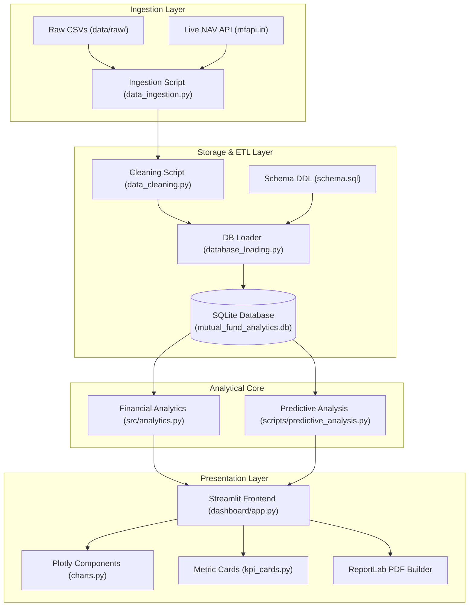
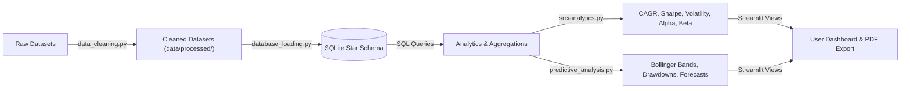
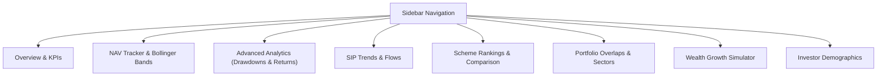
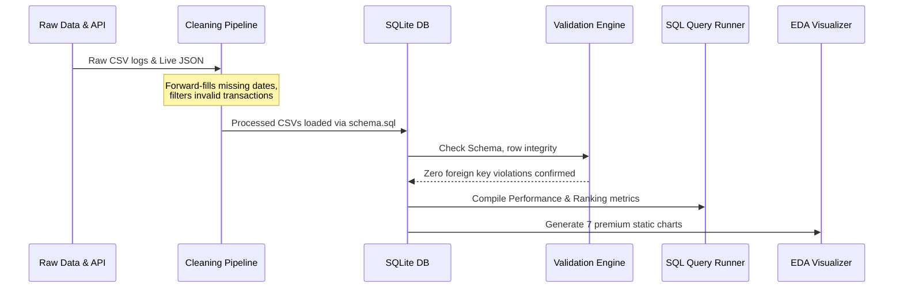
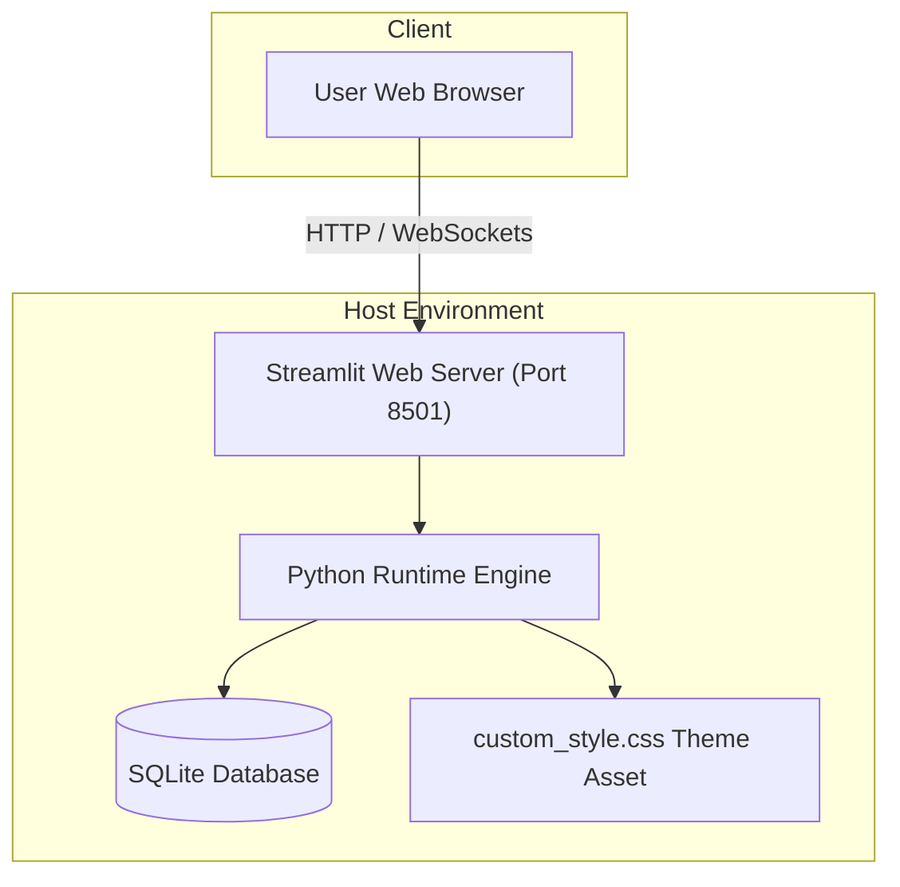
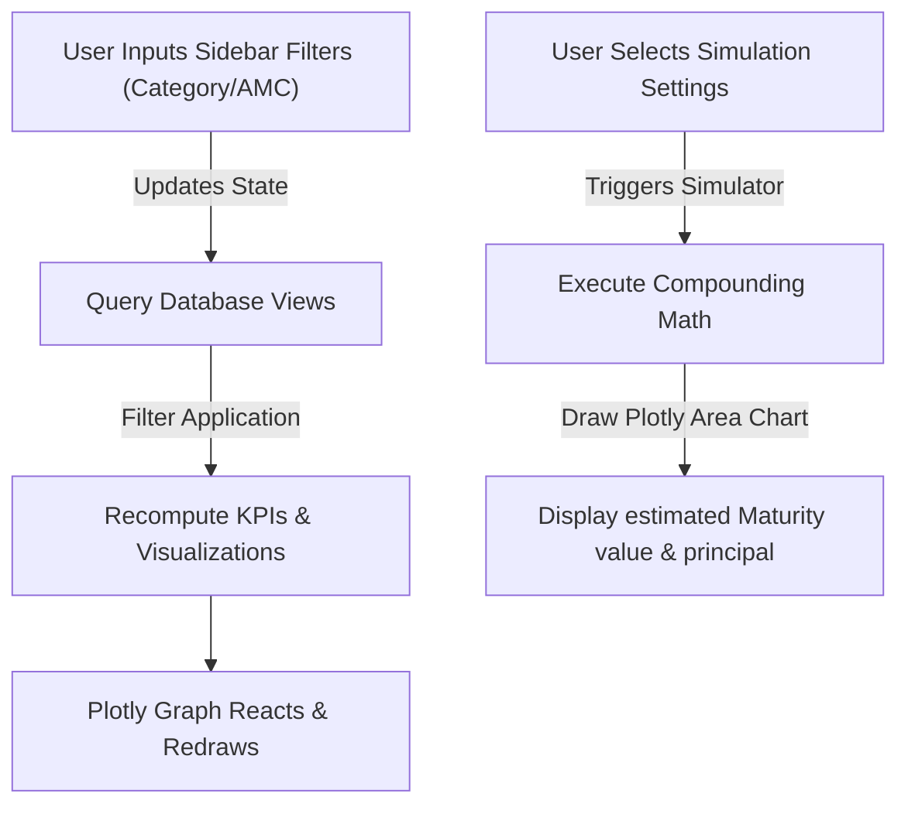

# Bluestock Mutual Fund Analytics Dashboard

[](https://www.python.org/)
[](https://streamlit.io/)
[](https://plotly.com/)
[](https://sqlite.org/)
[](https://github.com/eashita2409/bluestock-internship)
[](https://opensource.org/licenses/MIT)

An enterprise-grade, high-performance financial analytics and visualization platform built to ingest, clean, store, analyze, and forecast mutual fund performance. The dashboard features advanced risk-adjusted performance rankings, long-term wealth compounding simulators, real-time NAV tracking via the AMFI API, Bollinger Band volatility channels, portfolio sector overlap checks, and ReportLab PDF report generation.

---

## 🔗 Project Links

*   **Live Streamlit Deployment:** `[Insert Streamlit Deployment URL Here]` *(e.g., https://share.streamlit.io/eashita2409/bluestock-internship/main/dashboard/app.py)*
*   **Walkthrough Demo Video:** `[Insert Demo Video Link Here]` *(e.g., YouTube/Loom link)*
*   **Google Drive Submission Folder:** `[Insert Google Drive Submission Link Here]`
*   **GitHub Repository:** [https://github.com/eashita2409/bluestock-internship](https://github.com/eashita2409/bluestock-internship)

---

## 📸 Dashboard Preview

| **Overview & KPIs (Dark Mode)** | **NAV Tracker & Volatility Channel** |
|:---:|:---:|
| `[Screenshot Placement: Executive Overview]` | `[Screenshot Placement: NAV Bollinger Bands]` |
| **Portfolio Sector Overlap** | **Wealth Growth Simulator** |
| `[Screenshot Placement: Sector Allocation Overlap]` | `[Screenshot Placement: SIP Compounding Projection]` |

---

## 🚀 Key Features

*   **ETL Pipeline & Star Schema DB:** Standardizes and loads 10 raw CSV datasets into a relational SQLite database structure containing 11 tables with zero foreign key violations.
*   **Live NAV Fetcher:** Automated ingestion of daily NAV quotes directly from `mfapi.in` public API endpoints for primary mutual fund schemes.
*   **Advanced Financial Metrics:** Out-of-the-box calculations for Compound Annual Growth Rate (CAGR), Annualized Volatility, Sharpe Ratio, Sortino Ratio, Market Beta, and Jensen's Alpha.
*   **Risk & Volatility Analytics:** Overlay of 20-Day Simple Moving Averages (SMA) and Bollinger Bands alongside maximum historical peak-to-trough drawdowns and recovery periods.
*   **Predictive Forecaster:** Polynomial curve fitting (degree 2) to forecast next 30 days of NAV trends based on historical values.
*   **Investment Simulators:** Interactive compounding projection engines modeling monthly SIP vs. lumpsum deposits.
*   **Portfolio Overlap Analysis:** Computes the exact weight-based sector overlap between two selected funds to analyze diversification strength.
*   **Recruiter-Ready Exports:** Programmatic PDF report builder powered by ReportLab, alongside CSV dataset exports and custom dark/light theme overrides.

---

## 🛠️ Tech Stack

*   **Backend & Processing:** Python 3.10+, Pandas, NumPy, SciPy
*   **Database:** SQLite 3 (relational SQL backend)
*   **Frontend Dashboard:** Streamlit
*   **Data Visualizations:** Plotly Express & Plotly Graph Objects (Interactive), Seaborn & Matplotlib (Static)
*   **Predictive Modeling:** Scikit-Learn (Polynomial Fit, numpy.polyfit)
*   **Document Generation:** ReportLab (Programmatic PDF export)
*   **Testing Suite:** Pytest

---

## 📊 Architecture Diagrams

Here are the system design blueprints modeling the platform's layers. For a deep dive, see the complete [architecture.md](file:///c:/Users/eashi/OneDrive/Documents/GitHub/bluestock-internship/architecture.md) documentation.

### 1. System Architecture Diagram
This diagram represents the end-to-end flow from data ingestion to user presentation.



### 2. Data Flow Diagram
Tracks the lifecycle of database structures and analytical transformations.



### 3. Dashboard Module Flow
Represents the structural pages and user navigation layout.



### 4. Backend Processing Flow
Detailed processing pipelines run before deployment to generate reports and structure facts.



### 5. Deployment Architecture
How the application runs and serves client request sessions.



### 6. User Interaction Flow
Illustrates how the front-end dashboard responds dynamically to user controls.



---

## 📁 Project Folder Structure

Below is the directory architecture of the workspace:

```
bluestock-internship/
├── .gitignore
├── README.md                      # Primary project documentation
├── requirements.txt               # Project library dependencies
├── architecture.md                # System architecture documentation
├── deployment_guide.md            # App deployment guide
├── system_design.md               # Technical system design documentation
├── data/
│   ├── raw/                       # Raw source CSV files & live JSON API outputs
│   ├── processed/                 # Cleaned and standardized CSV datasets
│   └── db/
│       └── mutual_fund_analytics.db # SQLite relational database
├── src/
│   ├── __init__.py
│   ├── utils.py                   # Dynamic path resolvers & CSV loader utilities
│   └── analytics.py               # Financial formulas (CAGR, Sharpe, Beta, Alpha)
├── scripts/
│   ├── data_ingestion.py          # Ingests source files, checks reference integrity
│   ├── data_cleaning.py           # Cleans, forward-fills, and standardizes CSV data
│   ├── database_loading.py        # Initializes SQLite and loads CSVs into star schema
│   ├── database_validation.py     # Schema validators & foreign key constraints checking
│   ├── run_queries.py             # Analytical SQL query compiles
│   ├── eda_analysis.py            # Advanced statistics and static matplotlib charts
│   └── predictive_analysis.py     # Bollinger Bands, Drawdowns, & Polynomial Trend forecasts
├── sql/
│   ├── schema.sql                 # SQLite database schema DDL script
│   └── queries.sql                # Pre-written database analytical queries
├── notebooks/
│   ├── 01_data_ingestion.ipynb    # Ingestion & Live API interactive notebook
│   ├── 01_exploratory_analysis.ipynb # Initial data sandbox
│   ├── 02_database_operations.ipynb  # Schema creations & database operations
│   ├── 03_eda_and_visualization.ipynb # Advanced EDA plotting walkthrough
│   └── 04_advanced_analytics.ipynb   # Drawdowns, forecasting, and simulators
├── dashboard/
│   ├── app.py                     # Streamlit dashboard main entrypoint
│   ├── assets/
│   │   └── custom_style.css       # Custom styling overrides (Dark Mode & KPI layouts)
│   └── components/
│       ├── kpi_cards.py           # Metrics card container builder
│       └── charts.py              # Interactive Plotly chart configurations
├── tests/
│   ├── test_analytics.py          # Unit tests for financial formulas (CAGR, Sharpe, etc.)
│   └── test_database.py           # SQLite integrity & constraint validation checks
└── docs/
    ├── data_quality_report.md     # Ingestion data quality analysis
    ├── database_validation_report.md # Verification check summaries
    ├── database_analysis_report.md  # Core queries results and details
    ├── eda_report.md              # Advanced statistics and static charts details
    ├── final_business_report.md   # Capstone executive recommendations
    └── final_summary.md           # Days 1-4 milestone summary
```

---

## 📥 Installation & Local Setup

Follow these steps to run the analytics engine and frontend dashboard locally on your system:

### Prerequisite Checklist
*   Python 3.10 or higher installed.
*   SQLite3 installed (comes default with Python standard library).

### 1. Clone the Repository
```bash
git clone https://github.com/eashita2409/bluestock-internship.git
cd bluestock-internship
```

### 2. Create and Activate a Virtual Environment
*   **Windows (PowerShell):**
    ```powershell
    python -m venv .venv
    .venv\Scripts\Activate.ps1
    ```
*   **macOS / Linux:**
    ```bash
    python3 -m venv .venv
    source .venv/bin/activate
    ```

### 3. Install Package Dependencies
```bash
pip install -r requirements.txt
```

### 4. Run the ETL & Processing Pipeline
To load, clean, structure, and query the database from scratch, execute the following script chain:
```bash
# 1. Fetch raw data & write data quality profiling
python scripts/data_ingestion.py

# 2. Clean records, forward-fill missing dates
python scripts/data_cleaning.py

# 3. Load SQLite schemas and populate tables
python scripts/database_loading.py

# 4. Run database verification and constraint checks
python scripts/database_validation.py

# 5. Compile SQL queries and export analytics
python scripts/run_queries.py

# 6. Generate exploratory static charts
python scripts/eda_analysis.py

# 7. Run predictive analysis tests
python scripts/predictive_analysis.py
```

### 5. Run the Pytest Suite
Verify that financial formulas and database constraint configurations pass unit tests:
```bash
pytest
```

### 6. Launch the Streamlit Dashboard
```bash
streamlit run dashboard/app.py
```
Open your browser and navigate to `http://localhost:8501` to view the interactive dashboard.

---

## 📈 Analytics & Machine Learning Reference

*   **CAGR Formula:**
    $$CAGR = \left(\frac{\text{End Value}}{\text{Start Value}}\right)^{\frac{1}{\text{Years}}} - 1$$
*   **Sharpe Ratio:**
    $$Sharpe = \frac{R_p - R_f}{\sigma_p}$$
    *Where $R_p$ is annualized portfolio return, $R_f$ is risk-free rate (default 5%), and $\sigma_p$ is annualized return standard deviation.*
*   **Jensen's Alpha:**
    $$\alpha = R_p - [R_f + \beta(R_m - R_f)]$$
    *Where $R_m$ is annualized benchmark return, and $\beta$ is market beta.*
*   **Volatility Channel (Bollinger Bands):**
    *   *Middle Band* = 20-Day Simple Moving Average (SMA) of NAV.
    *   *Upper Band* = Middle Band + 2 * (20-Day Standard Deviation).
    *   *Lower Band* = Middle Band - 2 * (20-Day Standard Deviation).
*   **Predictive Forecasting Model:**
    Leverages a 2nd-degree polynomial curve fit ($\hat{y} = ax^2 + bx + c$) using `numpy.polyfit` over cumulative historical days to model intermediate and short-term trends over a 30-day forward horizon.

---

## ⚠️ Challenges Faced & Engineering Solutions

1.  **Missing NAV Logs:** Raw daily NAV datasets contained gaps due to weekends and public holidays.
    *   *Solution:* Implemented localized pandas forward-fill (`ffill()`) operations grouping by scheme, ensuring NAV prices carry forward accurately to reflect continuous valuation.
2.  **Database Thread Concurrency:** Streamlit runs on a multi-threaded architecture. Reusing a single SQLite connection pool would occasionally throw `ProgrammingError: SQLite objects created in a thread can only be used in that same thread`.
    *   *Solution:* Integrated Streamlit's `@st.cache_resource` wrapper alongside `sqlite3.connect(check_same_thread=False)` to safely cache database lookup connections across active sessions.
3.  **Stock Weight Allocation Mismatches:** Certain raw portfolio holdings weights exceeded 100% or contained negative asset exposures.
    *   *Solution:* Created validation rules inside `data_cleaning.py` to drop extreme outliers, flag records, and normalize weights where minor floating-point skew occurred.

---

## 🔮 Future Enhancements

*   **Advanced ML Models:** Transition from polynomial curve fits to neural networks (LSTM) or ARIMA models to incorporate macroeconomic indicators.
*   **User Profiles & Portfolios:** Add user authentication to allow users to build virtual watchlists, track personalized investments, and receive real-time rebalancing alerts.
*   **Live WebSockets integration:** Connect directly to Indian market feeds for live intraday stock price updates and portfolio re-valuations.

---

## 👥 Contributors

*   **Eashita** - *Lead Developer* - [eashita2409](https://github.com/eashita2409)

---

## 📄 License

This project is licensed under the MIT License - see the [LICENSE](LICENSE) file for details.
