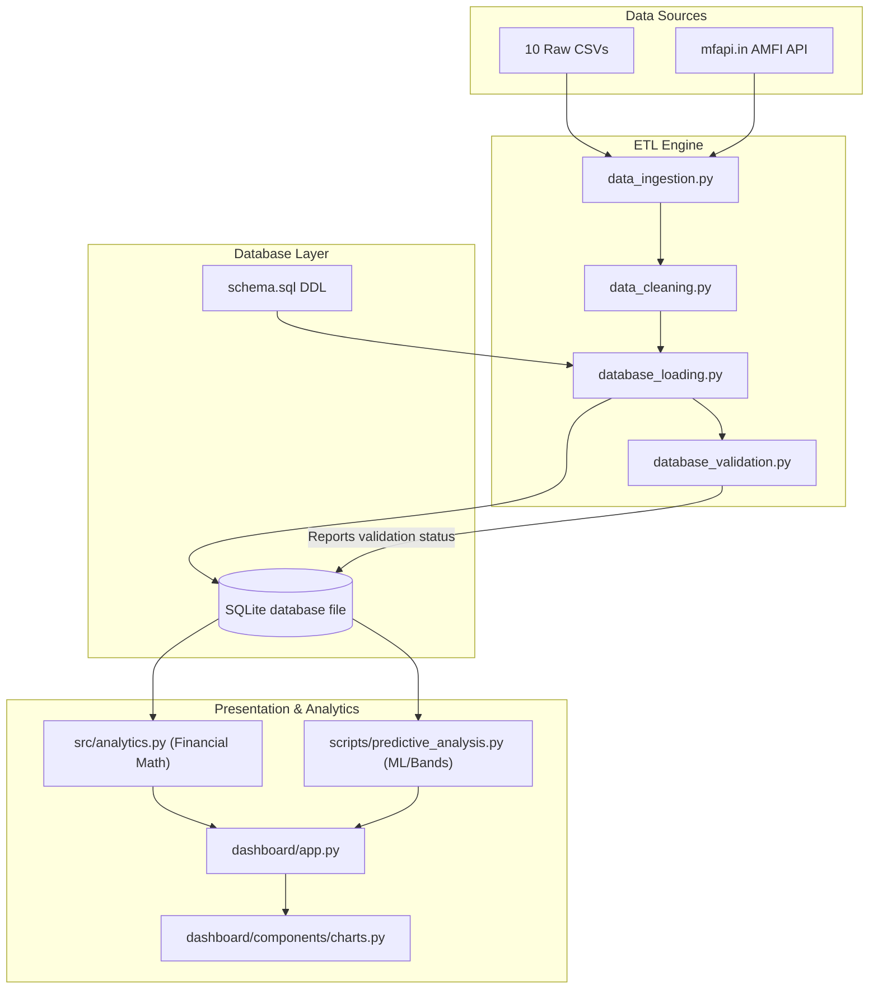
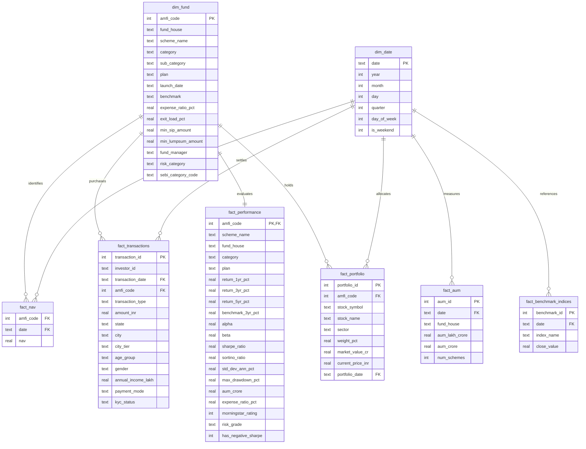

# Technical Project Architecture Document: Mutual Fund Analytics Platform

This document describes the architectural layout, data structures, relational models, pipelines, and schema definitions that govern the Bluestock Mutual Fund Analytics Platform.

---

## 1. Directory Structure Architecture

The codebase follows a modular layout designed to isolate data storage, backend scripts, financial math libraries, the Streamlit presentation layer, and unit tests:

```
bluestock-internship/
├── requirements.txt            # Python library dependencies
├── README.md                   # Main project portal
├── architecture.md             # This document
├── deployment_guide.md         # Local & Cloud deployment guide
├── system_design.md            # Financial formulas & modeling systems design
├── data/
│   ├── raw/                    # Source CSV datasets & live JSON API downloads
│   ├── processed/              # Standardized, cleaned CSV files ready for DB ingestion
│   └── db/
│       └── mutual_fund_analytics.db # SQLite database
├── src/
│   ├── __init__.py
│   ├── utils.py                # File handling and path utilities
│   └── analytics.py            # Financial ratio implementations (CAGR, Sharpe, etc.)
├── scripts/
│   ├── data_ingestion.py       # Ingests source files, checks reference integrity
│   ├── data_cleaning.py        # Cleans, forward-fills, and standardizes CSV data
│   ├── database_loading.py     # Initializes SQLite and loads CSVs into star schema
│   ├── database_validation.py  # Schema validators & foreign key constraints checking
│   ├── run_queries.py          # Analytical SQL query compiles
│   ├── eda_analysis.py         # Advanced statistics and static charts
│   └── predictive_analysis.py  # Bollinger Bands, Drawdowns, & Polynomial Trend forecasts
├── sql/
│   ├── schema.sql              # DDL schema definition script
│   └── queries.sql             # SQL query scripts
├── notebooks/
│   └── ...                     # 5 Interactive Jupyter development notebooks
├── dashboard/
│   ├── app.py                  # Streamlit entry point
│   ├── assets/                 # Theme styling (custom_style.css)
│   └── components/             # Reusable UI widgets (KPIs, Plotly charts)
└── tests/
    └── ...                     # Pytest suites checking database and financial logic
```

---

## 2. Component Layers & Interactions

The system comprises four core layers interacting through strict data pathways:



### Ingestion & Integration Layer
*   **`data_ingestion.py`**: Reads raw files in `data/raw/`, performs reference integrity checks to make sure schemes possess valid AMFI codes, downloads live NAV quotes, and outputs a preliminary data quality report under `docs/data_quality_report.md`.

### ETL & Relational Loading Layer
*   **`data_cleaning.py`**: Performs cleaning processes such as handling duplicate rows, filling in missing historical date records using forward-fill, filtering out invalid transaction amounts, and identifying extreme metric outliers.
*   **`database_loading.py`**: Runs the SQLite schema definitions script (`sql/schema.sql`) and loads the cleaned datasets into their respective relational tables.
*   **`database_validation.py`**: Checks that all record counts align with processed files and validates that foreign key references exist across the database.

### Relational Database Design (Star Schema)
The SQLite database `mutual_fund_analytics.db` is built around a centralized star schema optimized for fast analytical queries:



---

## 3. Detailed Data Dictionary

### Dimension Table: `dim_fund`
Primary dimension catalog of all mutual fund schemes.
*   `amfi_code` (INTEGER, PK): Association of Mutual Funds in India code, primary identifier.
*   `fund_house` (TEXT): Asset Management Company name.
*   `scheme_name` (TEXT): Official fund scheme title.
*   `category` (TEXT): Broad asset class (e.g. "Equity", "Debt").
*   `sub_category` (TEXT): Specific asset sub-class (e.g., "Large Cap", "Mid Cap").
*   `benchmark` (TEXT): Performance benchmark index.
*   `expense_ratio_pct` (REAL): Annual fund operating costs expressed as a percentage.
*   `min_sip_amount` (REAL): Minimum SIP installment value.

### Fact Table: `fact_nav`
Tracks daily Net Asset Value prices.
*   `amfi_code` (INTEGER, FK): Links to `dim_fund`.
*   `date` (TEXT, FK): YYYY-MM-DD date key, links to `dim_date`.
*   `nav` (REAL): Day's closing NAV price.

### Fact Table: `fact_transactions`
Captures individual investor transactions.
*   `transaction_id` (INTEGER, PK): Primary key auto-incremented.
*   `investor_id` (TEXT): Unique investor account identifier.
*   `transaction_date` (TEXT, FK): Links to `dim_date`.
*   `amfi_code` (INTEGER, FK): Links to `dim_fund`.
*   `transaction_type` (TEXT): "SIP", "Lumpsum", or "Redemption".
*   `amount_inr` (REAL): Value of the transaction.
*   `payment_mode` (TEXT): Payment gateway/mode (e.g., "UPI", "Net Banking").
*   `kyc_status` (TEXT): Status of the investor's KYC validation.

---

## 4. Architectural Design Decisions & Tradeoffs

1.  **SQLite as a Database Engine:**
    *   *Decision:* Chosen over a client-server database (e.g., PostgreSQL) to eliminate external dependencies, simplify developer onboarding, and provide local file persistence.
    *   *Tradeoff:* Concurrency limits. Since SQLite locks the file during writes, it is unsuitable for high-write applications, but performs excellently for this analytics dashboard which operates on a read-heavy load.
2.  **Star Schema vs. Flat Files:**
    *   *Decision:* Normalized the flat datasets into fact and dimension tables.
    *   *Tradeoff:* Involves joins, which can add minor query overhead. However, normalization prevents data anomaly bugs (e.g. updating a fund's manager requires updating one row in `dim_fund` rather than millions of transaction records) and drastically reduces SQLite file footprint size.
3.  **Local vs. API Ingestion Integration:**
    *   *Decision:* The dashboard accesses local SQLite data for core performance analytics, while querying external AMFI API quotes dynamically for real-time NAV tracking.
    *   *Tradeoff:* External API calls add network latency. Streamlit's caching was applied to store API JSON results and prevent repeated calls during page re-renders.
