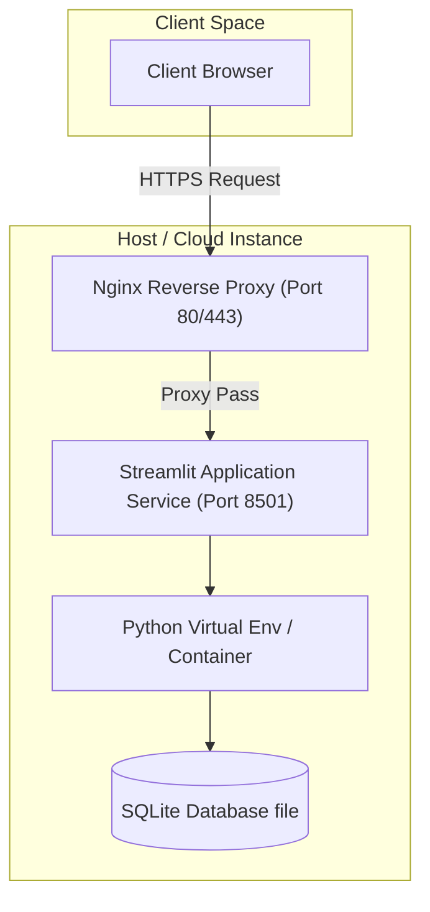

# Deployment and Setup Guide: Mutual Fund Analytics Platform

This guide walks you through deploying the Bluestock Mutual Fund Analytics Platform in various environments, including local development, Docker containers, Streamlit Community Cloud, and cloud VMs (AWS/GCP).

---

## 1. Deployment Architecture

The following diagram illustrates how the application resides on virtual hosts and routes client queries:



---

## 2. Local Environment Setup

### Prerequisites
*   Python 3.10+ installed
*   Git installed

### Step-by-Step Installation
1.  **Clone the project repository:**
    ```bash
    git clone https://github.com/eashita2409/bluestock-internship.git
    cd bluestock-internship
    ```
2.  **Initialize a virtual environment:**
    *   **Windows (PowerShell):**
        ```powershell
        python -m venv .venv
        .venv\Scripts\Activate.ps1
        ```
    *   **macOS / Linux:**
        ```bash
        python3 -m venv .venv
        source .venv/bin/activate
        ```
3.  **Install dependencies:**
    ```bash
    pip install -r requirements.txt
    ```
4.  **Execute the ETL Pipeline:**
    To load and clean all raw CSVs and build the SQLite database, run the script chain:
    ```bash
    python scripts/data_ingestion.py
    python scripts/data_cleaning.py
    python scripts/database_loading.py
    python scripts/database_validation.py
    python scripts/run_queries.py
    ```
5.  **Run Pytest Verification:**
    ```bash
    pytest
    ```
6.  **Launch the Streamlit Server:**
    ```bash
    streamlit run dashboard/app.py
    ```

---

## 3. Deploying to Streamlit Community Cloud

Streamlit Community Cloud is the easiest way to deploy and share this dashboard for free.

### Step-by-Step Deployment
1.  **Push the repository to GitHub:** Ensure all files (especially `requirements.txt`, `dashboard/app.py`, and the SQLite database file `data/db/mutual_fund_analytics.db`) are pushed to your GitHub repository.
2.  **Sign in to Streamlit:** Visit [share.streamlit.io](https://share.streamlit.io/) and log in using your GitHub account credentials.
3.  **Create New App:**
    *   Click the **"New app"** button.
    *   Select the repository (`bluestock-internship`), branch (`main` or `master`), and set the main file path to `dashboard/app.py`.
4.  **Configure App Settings:**
    *   Click **"Deploy!"**. Streamlit will read the `requirements.txt` file and install all packages in a secure Linux sandbox.
    *   The deployment will be complete in a few minutes, after which your live dashboard will be accessible via a shareable URL.

> [!IMPORTANT]
> Since SQLite is a file-based database, committing `data/db/mutual_fund_analytics.db` directly to your GitHub repository ensures the Streamlit application reads all processed records successfully.

---

## 4. Docker Containerization

To deploy the application inside an isolated Docker container:

### 1. Create a `Dockerfile`
Create a file named `Dockerfile` in the project root directory:

```dockerfile
# Use an official lightweight Python image
FROM python:3.10-slim

# Set work directory
WORKDIR /app

# Install system dependencies (for building reportlab/scipy if needed)
RUN apt-get update && apt-get install -y \
    build-essential \
    curl \
    software-properties-common \
    && rm -rf /var/lib/apt/lists/*

# Copy requirements file
COPY requirements.txt .

# Install Python requirements
RUN pip install --no-cache-dir -r requirements.txt

# Copy application files
COPY . .

# Expose default Streamlit port
EXPOSE 8501

# Health check to monitor container health
HEALTHCHECK CMD curl --fail http://localhost:8501/_stcore/health

# Command to execute Streamlit on container startup
ENTRYPOINT ["streamlit", "run", "dashboard/app.py", "--server.port=8501", "--server.address=0.0.0.0"]
```

### 2. Build and Run the Docker Image
1.  **Build the Docker image:**
    ```bash
    docker build -t mutual-fund-dashboard:latest .
    ```
2.  **Run the container:**
    ```bash
    docker run -d -p 8501:8501 --name mf-dashboard mutual-fund-dashboard:latest
    ```
3.  **Access the application:** Open `http://localhost:8501` in your browser.

---

## 5. Cloud Virtual Machine Deployment (AWS EC2 / GCP Compute)

For professional production workloads, you can host the app on a cloud VM.

### 1. Launch a VM
Launch an Ubuntu Server VM (e.g., AWS t2.micro or GCP f1-micro) and open inbound ports:
*   **Port 22** (SSH access)
*   **Port 80/443** (HTTP/HTTPS Nginx proxy)

### 2. Connect and Install Software
```bash
sudo apt update && sudo apt upgrade -y
sudo apt install python3-pip python3-venv git nginx -y
```

### 3. Deploy App and Set Up Systemd Service
Clone the repository and set up a systemd background service so that the dashboard survives system crashes and restarts.

Create a file named `/etc/systemd/system/streamlit.service`:
```ini
[Unit]
Description=Streamlit Mutual Fund Analytics Service
After=network.target

[Service]
User=ubuntu
WorkingDirectory=/home/ubuntu/bluestock-internship
ExecStart=/home/ubuntu/bluestock-internship/.venv/bin/streamlit run dashboard/app.py --server.port=8501 --server.address=0.0.0.0
Restart=always

[Install]
WantedBy=multi-user.target
```
Activate and run the service:
```bash
sudo systemctl daemon-reload
sudo systemctl enable streamlit
sudo systemctl start streamlit
```

### 4. Configure Nginx Reverse Proxy
Edit the Nginx configuration file `/etc/nginx/sites-available/default`:
```nginx
server {
    listen 80;
    server_name your-domain-or-ip;

    location / {
        proxy_pass http://127.0.0.1:8501;
        proxy_http_version 1.1;
        proxy_set_header Upgrade $http_upgrade;
        proxy_set_header Connection "upgrade";
        proxy_set_header Host $host;
        proxy_set_header X-Real-IP $remote_addr;
        proxy_set_header X-Forwarded-For $proxy_add_x_forwarded_for;
    }
}
```
Restart Nginx:
```bash
sudo systemctl restart nginx
```
Your dashboard is now live and accessible at your domain or public IP over standard HTTP port 80.
