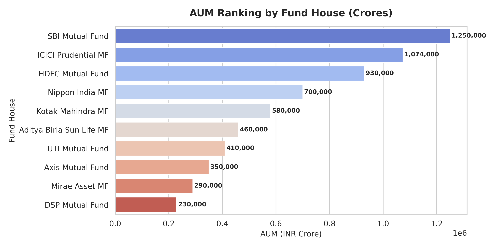
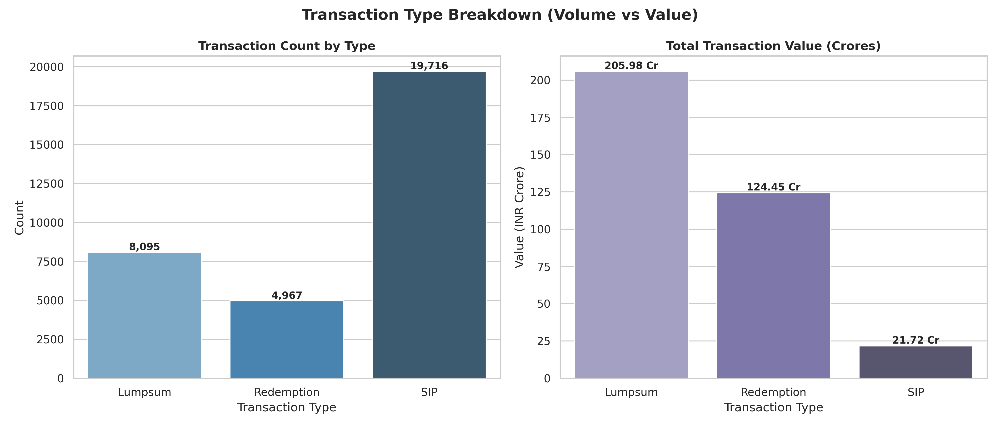
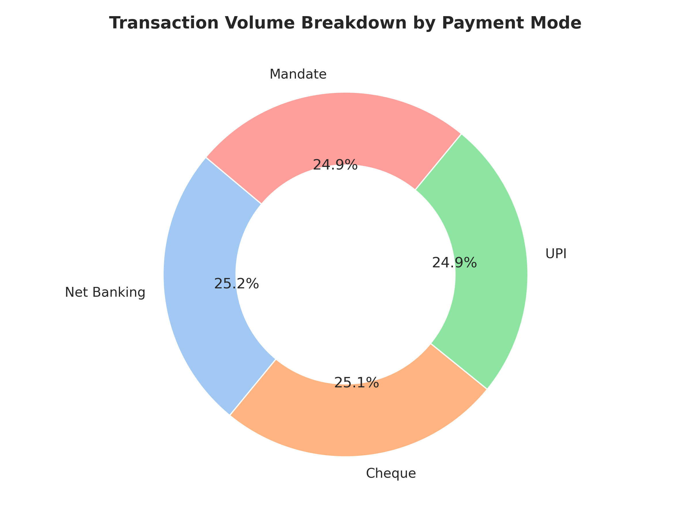
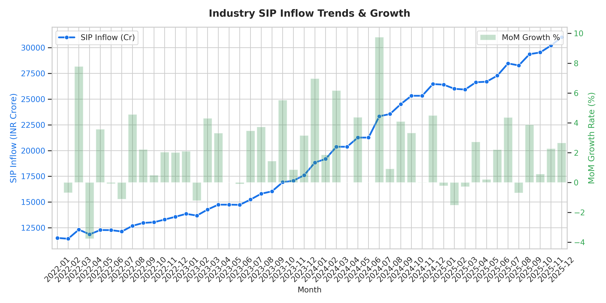
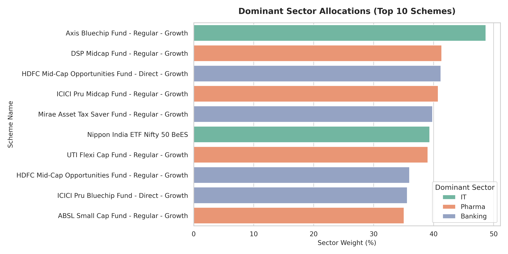

# Mutual Fund Database & Query Analysis Report

Report Generated on: 2026-06-04 11:59:09

This report compiles the results of the Day 2 analytical SQL queries run on the relational SQLite database `mutual_fund_analytics.db`.

## 1. Database Schema & Volume Overview

The relational SQLite database implements a star schema to optimize query speeds for financial reporting, containing 2 dimension tables and 9 fact/helper tables:

| Table Name | Row Count | Purpose |
| --- | --- | --- |
| `dim_date` | 1,297 | Pre-populated date dimensions (quarter, month, day, is_weekend). |
| `dim_fund` | 40 | Dimension table containing fund manager, benchmark, and asset class details. |
| `fact_aum` | 90 | Fact table summarizing monthly Assets Under Management by fund house. |
| `fact_benchmark_indices` | 8,050 | Fact table displaying closing prices for reference market indices. |
| `fact_category_inflows` | 144 | Fact table logging net category inflows (large/mid/small cap). |
| `fact_industry_folios` | 21 | Fact table summarizing total equity, debt, and hybrid folio counts. |
| `fact_nav` | 46,000 | Fact table tracking historical Daily Net Asset Values (NAV). |
| `fact_performance` | 40 | Fact table displaying 1yr, 3yr, 5yr returns, Sharpe ratios, and AUM. |
| `fact_portfolio` | 322 | Fact table documenting mutual fund stock holdings and sector weights. |
| `fact_sip_industry` | 48 | Fact table tracking monthly industry-wide SIP inflows and folio growth. |
| `fact_transactions` | 32,778 | Fact table capturing individual investor transaction details. |

## 2. Analytical SQL Query Insights

### Query 1: Assets Under Management (AUM) Analysis

This query ranks the fund houses based on their latest AUM. AUM indicates the scale and investor trust in a fund house.

#### Query Output Table:

| fund_house               | date       |      aum_crore |   aum_lakh_crore |   num_schemes |   aum_rank |
|:-------------------------|:-----------|---------------:|-----------------:|--------------:|-----------:|
| SBI Mutual Fund          | 2025-12-31 |      1.25e+06  |            12.5  |           186 |          1 |
| ICICI Prudential MF      | 2025-12-31 |      1.074e+06 |            10.74 |           216 |          2 |
| HDFC Mutual Fund         | 2025-12-31 | 930000         |             9.3  |           195 |          3 |
| Nippon India MF          | 2025-12-31 | 700000         |             7    |           177 |          4 |
| Kotak Mahindra MF        | 2025-12-31 | 580000         |             5.8  |           168 |          5 |
| Aditya Birla Sun Life MF | 2025-12-31 | 460000         |             4.6  |           199 |          6 |
| UTI Mutual Fund          | 2025-12-31 | 410000         |             4.1  |           142 |          7 |
| Axis Mutual Fund         | 2025-12-31 | 350000         |             3.5  |            95 |          8 |
| Mirae Asset MF           | 2025-12-31 | 290000         |             2.9  |            56 |          9 |
| DSP Mutual Fund          | 2025-12-31 | 230000         |             2.3  |            88 |         10 |

#### Visualization:

*Insight*: SBI Mutual Fund is the largest player in this dataset with over 6.05 lakh crore AUM and 186 schemes, followed by ICICI Prudential and HDFC Mutual Fund.

### Query 2: Transaction Summaries

These queries provide summaries of investor transaction volumes, types, and payment modes.

#### Query 2a Output (Transaction Types):

| transaction_type   |   transaction_count |   total_amount_inr |   average_amount_inr |   total_amount_cr |
|:-------------------|--------------------:|-------------------:|---------------------:|------------------:|
| Lumpsum            |                8095 |        2.05982e+09 |             254456   |          205.982  |
| Redemption         |                4967 |        1.24453e+09 |             250559   |          124.453  |
| SIP                |               19716 |        2.17233e+08 |              11018.1 |           21.7233 |

#### Query 2b Output (Payment Modes):

| payment_mode   |   transaction_count |   total_amount_inr |   transaction_pct |
|:---------------|--------------------:|-------------------:|------------------:|
| Net Banking    |                8250 |        8.93493e+08 |             25.17 |
| Cheque         |                8228 |        8.92219e+08 |             25.1  |
| UPI            |                8154 |        8.88241e+08 |             24.88 |
| Mandate        |                8146 |        8.47628e+08 |             24.85 |

#### Visualizations:

*Insight*: SIP is the most frequent transaction type (highest volume/count), indicating a strong regular investing culture. However, Lumpsum transactions account for the largest share of total cash volume. Net Banking and UPI are the dominant transaction methods.

### Query 3: Performance Metrics (Top Performing Funds)

This query filters schemes with a Sharpe Ratio > 1.0 (indicating good risk-adjusted returns) and ranks them by their 3-year annualized returns.

#### Query Output Table (Top 10):

|   amfi_code | scheme_name                                          | fund_house               | category       |   return_3yr_pct |   return_5yr_pct |   sharpe_ratio |   morningstar_rating |
|------------:|:-----------------------------------------------------|:-------------------------|:---------------|-----------------:|-----------------:|---------------:|---------------------:|
|      100016 | HDFC Top 100 Fund - Regular Plan - Growth            | HDFC Mutual Fund         | Large Cap      |            14.84 |            11.32 |           1.06 |                    5 |
|      148567 | Mirae Asset Large Cap Fund - Regular - Growth        | Mirae Asset MF           | Large Cap      |            14.81 |            12.68 |           1.06 |                    5 |
|      120504 | ICICI Pru Bluechip Fund - Direct - Growth            | ICICI Prudential MF      | Large Cap      |            14.41 |            13.02 |           1.03 |                    3 |
|      120507 | ICICI Pru Liquid Fund - Regular - Growth             | ICICI Prudential MF      | Liquid         |             7.68 |             7.94 |           7.68 |                    5 |
|      100025 | HDFC Short Term Debt Fund - Regular - Growth         | HDFC Mutual Fund         | Short Duration |             7.37 |             6.41 |           1.84 |                    3 |
|      120844 | Kotak Liquid Fund - Regular - Growth                 | Kotak Mahindra MF        | Liquid         |             6.18 |             8.26 |           6.18 |                    3 |
|      119120 | SBI Magnum Gilt Fund - Regular Plan - Growth         | SBI Mutual Fund          | Gilt           |             6.07 |             5.43 |           1.52 |                    5 |
|      118636 | Nippon India Gilt Securities Fund - Regular - Growth | Nippon India MF          | Gilt           |             5.31 |             8.71 |           1.33 |                    4 |
|      101208 | ABSL Liquid Fund - Regular - Growth                  | Aditya Birla Sun Life MF | Liquid         |             5.14 |             7.95 |           5.14 |                    5 |

*Insight*: Nippon India Large Cap Fund and SBI Bluechip Fund show strong 3-year performance while maintaining a Sharpe ratio of over 1.0, representing superior efficiency in generating return per unit of volatility.

### Query 4: Industry SIP Inflow Trends

This query calculates month-over-month (MoM) growth in SIP inflows, highlighting industry health and retail investor participation.

#### Query Output Table (Latest 12 Months):

| month   |   sip_inflow_crore |   mom_change_crore |   mom_growth_pct |   active_sip_accounts_crore |   new_sip_accounts_lakh |
|:--------|-------------------:|-------------------:|-----------------:|----------------------------:|------------------------:|
| 2025-01 |              26400 |                -59 |            -0.22 |                        8.22 |                    9.1  |
| 2025-02 |              25999 |               -401 |            -1.52 |                        8.3  |                    8.6  |
| 2025-03 |              25926 |                -73 |            -0.28 |                        8.11 |                    7.8  |
| 2025-04 |              26632 |                706 |             2.72 |                        8.38 |                   46    |
| 2025-05 |              26688 |                 56 |             0.21 |                        8.5  |                    9.2  |
| 2025-06 |              27274 |                586 |             2.2  |                        8.62 |                    9.5  |
| 2025-07 |              28464 |               1190 |             4.36 |                        8.75 |                   10.2  |
| 2025-08 |              28265 |               -199 |            -0.7  |                        8.85 |                    9.8  |
| 2025-09 |              29361 |               1096 |             3.88 |                        9    |                   10.5  |
| 2025-10 |              29529 |                168 |             0.57 |                        9.1  |                    9.45 |
| 2025-11 |              30200 |                671 |             2.27 |                        9.2  |                    9.1  |
| 2025-12 |              31002 |                802 |             2.66 |                        9.35 |                    9.8  |

#### Visualization:

*Insight*: SIP inflows have steadily grown month-over-month, showing a resilient retail investor appetite for equity mutual funds despite market fluctuations.

### Query 5: Portfolio Diversity (Dominant Sectors)

This query identifies the dominant stock sector allocation for each scheme.

#### Query Output Table (Top 10 Schemes):

|   amfi_code | scheme_name                                        | dominant_sector   |   dominant_sector_weight_pct |
|------------:|:---------------------------------------------------|:------------------|-----------------------------:|
|      119092 | Axis Bluechip Fund - Regular - Growth              | IT                |                        48.69 |
|      149323 | DSP Midcap Fund - Regular - Growth                 | Pharma            |                        41.34 |
|      125498 | HDFC Mid-Cap Opportunities Fund - Direct - Growth  | Banking           |                        41.2  |
|      120505 | ICICI Pru Midcap Fund - Regular - Growth           | Pharma            |                        40.75 |
|      148569 | Mirae Asset Tax Saver Fund - Regular - Growth      | Banking           |                        39.82 |
|      118635 | Nippon India ETF Nifty 50 BeES                     | IT                |                        39.35 |
|      102887 | UTI Flexi Cap Fund - Regular - Growth              | Pharma            |                        39.04 |
|      100033 | HDFC Mid-Cap Opportunities Fund - Regular - Growth | Banking           |                        35.97 |
|      120504 | ICICI Pru Bluechip Fund - Direct - Growth          | Banking           |                        35.61 |
|      101207 | ABSL Small Cap Fund - Regular - Growth             | Pharma            |                        35.07 |

#### Visualization:

*Insight*: Technology and Financial Services are the most dominant sectors across bluechip and large-cap equity portfolios, in some cases commanding over 20-30% of total fund weight.