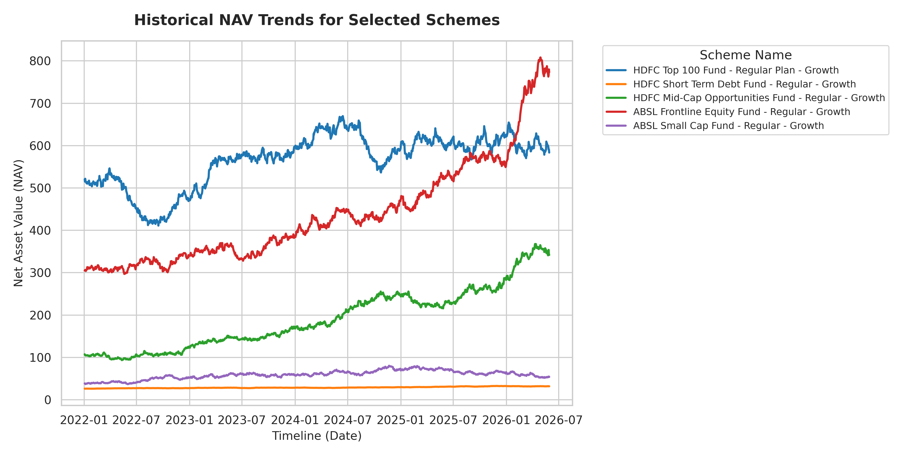
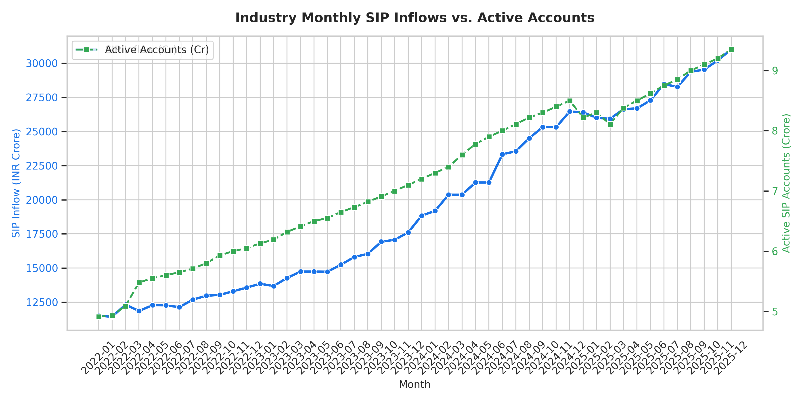
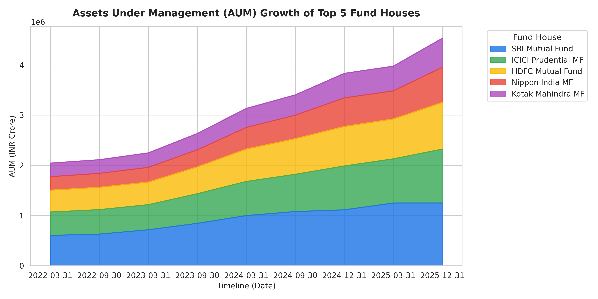
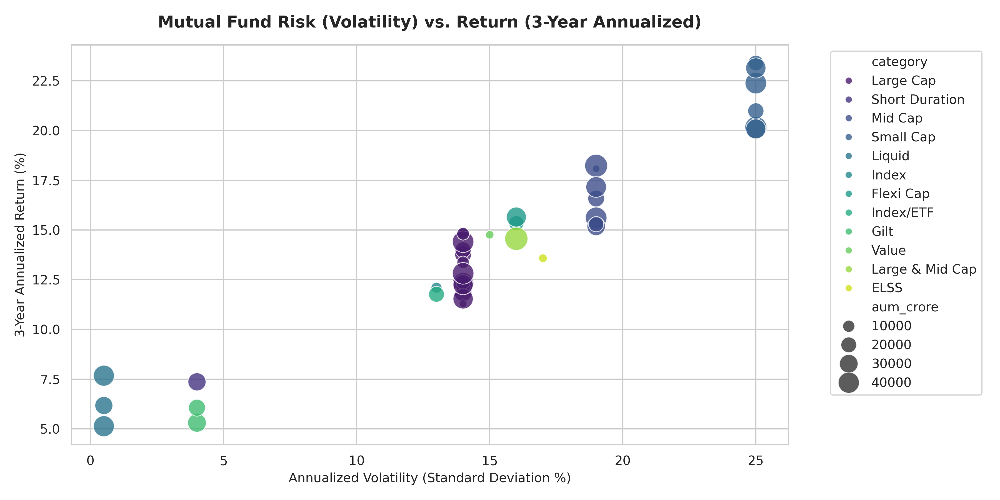
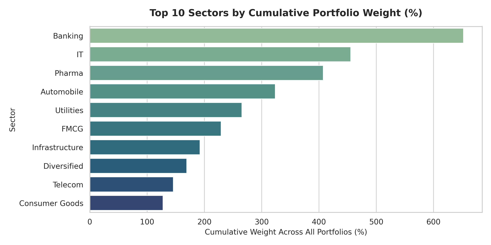
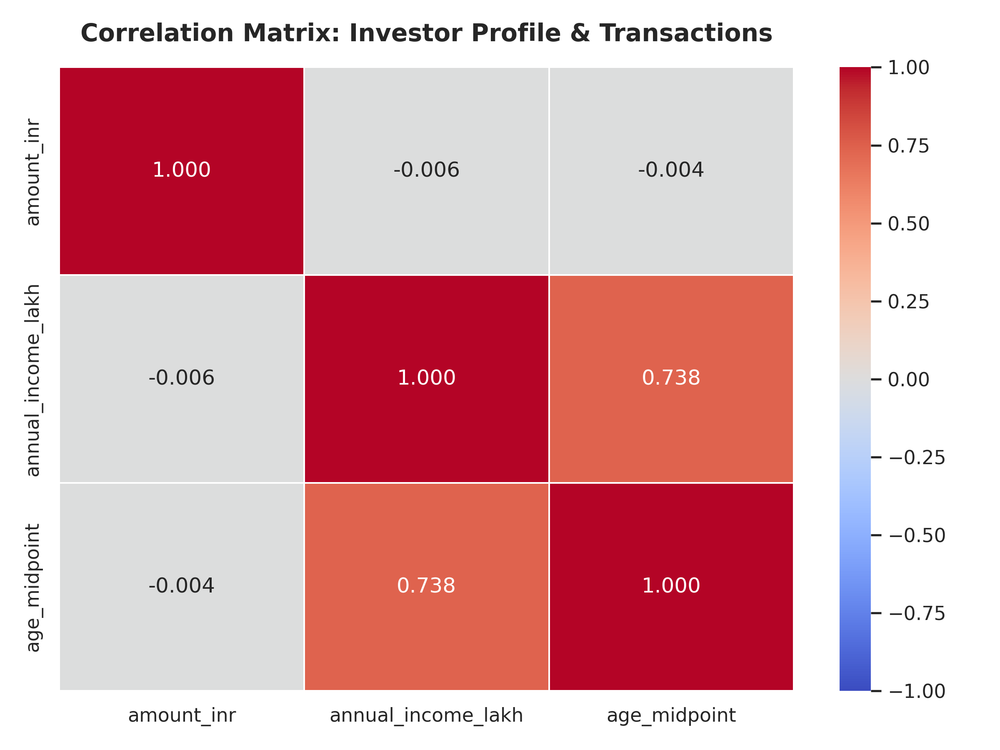
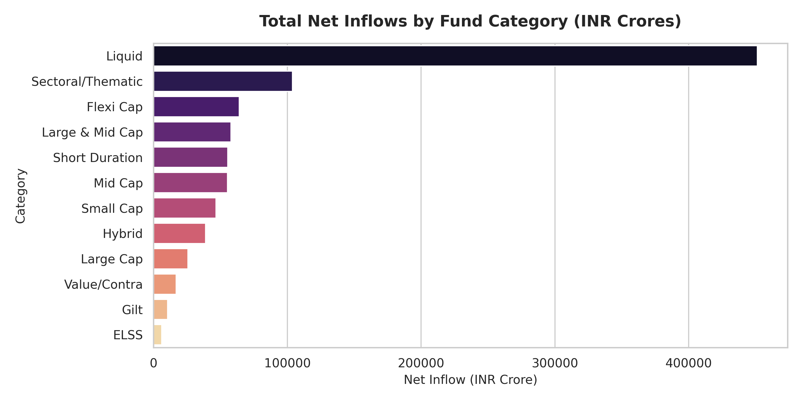

# Advanced Exploratory Data Analysis (EDA) & Insights Report

Report Generated on: 2026-06-04 12:13:18

This report presents a thorough analysis of mutual fund NAV trends, SIP inflows, AUM, portfolio sector allocation, and investor demographics.

## 1. Daily Net Asset Value (NAV) Trends

Analyzing historical NAV trends shows how different schemes fluctuate over time. High volatility usually indicates equity-heavy exposure, while flat lines correspond to stable liquid funds.

*Observation*: Equity large-cap funds show cyclical fluctuations and strong upward growth over long timelines. Liquid debt schemes remain highly linear, prioritizing wealth preservation over capital appreciation.

## 2. Industry SIP Inflows & Retail Accounts Growth

SIP inflows represent regular, recurring investments by retail investors. Tracking inflow amount alongside the total active account volume tells us if retail investor momentum is increasing.

*Observation*: There is a near-perfect positive correlation between industry SIP inflows and active account volume. Active accounts grew from ~4.9 crore to over 9.3 crore, and monthly inflows rose from ~11,500 crore to over 31,000 crore, indicating highly resilient long-term capital accumulation.

## 3. Assets Under Management (AUM) Growth

AUM is the cumulative market value of assets managed by a fund house. We trace how the aggregate AUM of the top 5 fund houses has expanded over the last several quarters.

*Observation*: The total assets under management have grown consistently. SBI Mutual Fund, ICICI Prudential, and HDFC Mutual Fund command the largest market share, showing that bank-backed mutual funds leverage their physical branch networks to capture inflows.

## 4. Risk vs. Return Analysis (3-Year Horizon)

A premium scatter plot plots standard deviation (representing risk/volatility) on the X-axis and annualized return on the Y-axis. The dot size represents AUM, and colors represent the asset category.

*Observation*: Large-cap and mid-cap equity schemes occupy the top-right sector, with standard deviation above 13% but delivering returns between 12-15%. Gilt and short-term debt schemes occupy the bottom-left quadrant (low risk, stable 5-7% returns). The optimal funds are those placed in the upper-left area, achieving high return per unit of volatility.

## 5. Sector Allocations Across Portfolios

Portfolio diversification tells us how funds distribute risk. This chart aggregates the cumulative weight percentage of stocks held in portfolios grouped by sector.

*Observation*: Financial Services (Banking, Insurance, NBFCs) and IT command the highest cumulative weight (over 100% total weight across schemes). This reflects the composition of major indices like Nifty 50, where financial sector weights are heavy.

## 6. Investor Transaction Correlation Heatmap

We calculate Pearson correlation coefficients between numeric fields: transaction amount, annual income, and mapped age midpoints.

*Observation*: There is a weak positive correlation between annual income and transaction amount. This implies that while higher-income investors have a higher propensity to invest larger sums, mutual funds are highly democratized, capturing a high volume of small-ticket SIPs from younger age groups.

## 7. Category-wise Inflows Comparison

Net inflows capture total sales minus redemptions. This comparison groups monthly inflows by mutual fund categories to see which asset class captures the most retail capital.

*Observation*: Large Cap, Mid Cap, and Small Cap equity funds capture the largest share of net inflows. Debt funds have lower net inflows, indicating retail investors are increasingly utilizing equity funds for wealth creation while using banking products or corporate bonds for fixed income.