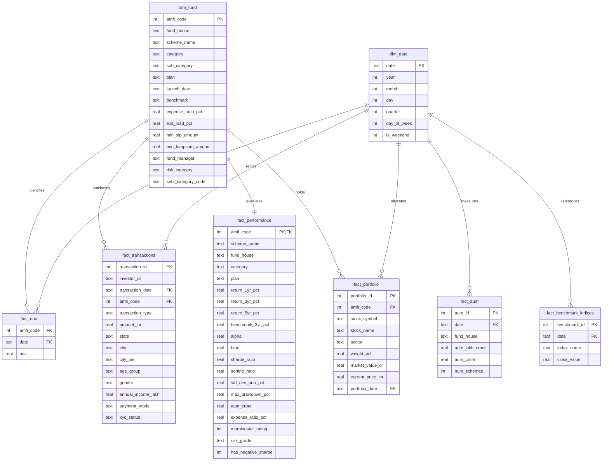
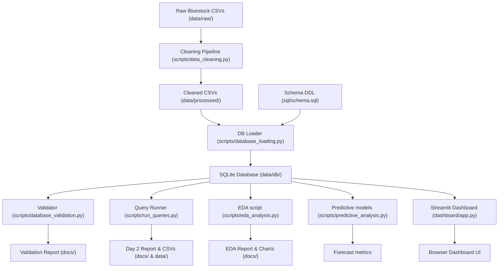

# Technical Project Architecture Document: Mutual Fund Analytics Platform

This document describes the folder structure, data models, processing pipelines, and system dependencies of the Bluestock Mutual Fund Analytics Platform.

---

## 1. System Folder Architecture

```
bluestock-internship/
├── .gitignore
├── requirements.txt            # System library dependencies
├── data/
│   ├── raw/                    # Original Bluestock CSV files & live JSON API dumps
│   ├── processed/              # Cleaned, standardized CSV files ready for database load
│   └── db/
│       └── mutual_fund_analytics.db # SQLite relational database
├── src/
│   ├── __init__.py
│   ├── utils.py                # Core dynamic path resolving & CSV loading utilities
│   └── analytics.py            # Financial formulas (CAGR, Sharpe, Beta, Alpha)
├── scripts/
│   ├── data_ingestion.py       # Ingests, checks reference integrity, generates data quality report
│   ├── data_cleaning.py        # Cleans, forward-fills, and standardizes CSV data
│   ├── database_loading.py     # Executes Schema DDL and loads CSV tables into SQLite
│   ├── database_validation.py  # Checks row counts, schemas, and foreign keys
│   ├── run_queries.py          # Executes analytical SQL queries and generates CSV exports
│   ├── eda_analysis.py         # Performs advanced statistics and outputs static charts
│   └── predictive_analysis.py  # Drawdowns, Bollinger bands, and polynomial price forecasting
├── sql/
│   ├── schema.sql              # Relational SQLite database schema DDL script
│   └── queries.sql             # Day 2 core analytical queries
├── notebooks/
│   ├── 01_data_ingestion.ipynb # Interactive ingestion & API fetching
│   ├── 01_exploratory_analysis.ipynb # Getting started exploratory sandbox
│   ├── 02_database_operations.ipynb  # Rebuilding database & querying
│   ├── 03_eda_and_visualization.ipynb # Advanced plotting and analysis
│   └── 04_advanced_analytics.ipynb   # Drawdowns, forecasting, and simulations
├── dashboard/
│   ├── app.py                  # Streamlit dashboard main application file
│   ├── assets/
│   │   └── custom_style.css    # Custom CSS for glassmorphic cards and theme overrides
│   └── components/
│       ├── kpi_cards.py        # Reusable HTML metric card generator
│       └── charts.py           # Interactive Plotly chart builders
├── tests/
│   ├── test_analytics.py       # Unit tests for financial formulas (pytest)
│   └── test_database.py        # Relational database integrity & constraint tests
└── docs/
    ├── data_quality_report.md  # Day 1 data quality details
    ├── database_validation_report.md # SQLite integrity check logs
    ├── database_analysis_report.md  # Day 2 SQL query outputs and insights
    ├── eda_report.md           # Day 3 advanced stats & findings
    ├── final_business_report.md # Day 4 executive summary & recommendations
    ├── project_architecture.md  # System architecture & data dictionary
    └── final_summary.md        # High-level summary of capstone milestones
```

---

## 2. Relational Database Design (Star Schema)

The SQLite database `mutual_fund_analytics.db` is built as a star schema consisting of 2 dimension tables and 9 fact/helper tables:



---

## 3. Data Processing Pipelines



---

## 4. Primary Data Dictionary

### Table: `dim_fund`
Primary dimension catalog of all mutual fund schemes.
- `amfi_code` (INTEGER, PK): Association of Mutual Funds in India code, primary identifier.
- `fund_house` (TEXT): Asset Management Company name (e.g. "SBI Mutual Fund").
- `scheme_name` (TEXT): Official fund scheme title.
- `category` (TEXT): Broad asset class (e.g. "Equity", "Debt", "Liquid").
- `expense_ratio_pct` (REAL): Annual fund operating costs expressed as a percentage of assets.
- `min_sip_amount` (REAL): Minimum SIP installment value.

### Table: `fact_nav`
Tracks daily Net Asset Value prices.
- `amfi_code` (INTEGER, FK): Links to `dim_fund`.
- `date` (TEXT, FK): YYYY-MM-DD date key, links to `dim_date`.
- `nav` (REAL): Day's closing NAV price.

### Table: `fact_transactions`
Captures individual investor transactions.
- `transaction_id` (INTEGER, PK): Primary key auto-incremented.
- `investor_id` (TEXT): Unique investor account identifier.
- `transaction_date` (TEXT, FK): Links to `dim_date`.
- `amfi_code` (INTEGER, FK): Links to `dim_fund`.
- `transaction_type` (TEXT): "SIP", "Lumpsum", or "Redemption".
- `amount_inr` (REAL): Value of the transaction.
- `annual_income_lakh` (REAL): Annual income in Lakhs.
- `payment_mode` (TEXT): "UPI", "Net Banking", "Cheque", or "Mandate".
- `kyc_status` (TEXT): "Verified" or "Pending".
