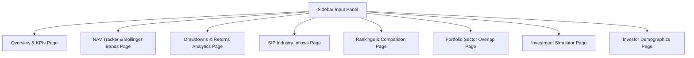
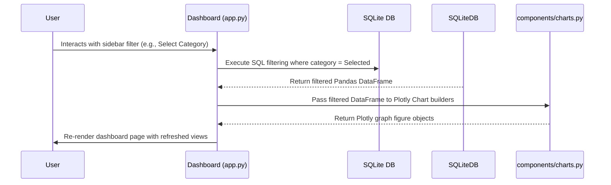

# System Design and Core Logic Documentation: Mutual Fund Analytics Platform

This document describes the technical design patterns, mathematical formulas, predictive modeling systems, and visualization frameworks implemented in the Bluestock Mutual Fund Analytics Platform.

---

## 1. System Processing Workflows

The platform leverages modular logic for user interactions, background data flows, and dashboard views.

### 1.1 Dashboard Module Flow
Defines the functional pages accessible via the navigation sidebar.



### 1.2 User Interaction Flow
Illustrates the data reactivity process when a user interacts with the UI.



---

## 2. Core Financial Calculations

The primary financial equations are coded inside [analytics.py](file:///c:/Users/eashi/OneDrive/Documents/GitHub/bluestock-internship/src/analytics.py). These formulas compute mutual fund yields, benchmark tracking errors, and risk metrics.

### 2.1 Compound Annual Growth Rate (CAGR)
CAGR measures the annualized rate of an investment's growth over a specific period, assuming the investment compounded over that period.

*   **Formula:**
    $$CAGR = \left(\frac{\text{End Value}}{\text{Start Value}}\right)^{\frac{1}{\text{Years}}} - 1$$
*   **Code Implementation:**
    ```python
    def calculate_cagr(start_value: float, end_value: float, years: float) -> float:
        if start_value <= 0 or end_value <= 0:
            raise ValueError("Start and end values must be positive numbers greater than 0.")
        if years <= 0:
            raise ValueError("Years must be a positive number greater than 0.")
        return (end_value / start_value) ** (1.0 / years) - 1.0
    ```

### 2.2 Annualized Volatility
Volatility represents the degree of variation in trading price series over time. It is measured by the annualized standard deviation of daily returns.

*   **Formula:**
    $$\sigma_{\text{ann}} = \sigma_{\text{daily}} \times \sqrt{252}$$
*   **Code Implementation:**
    ```python
    def calculate_annualized_volatility(returns: pd.Series, periods_per_year: int = 252) -> float:
        clean_returns = returns.dropna()
        if len(clean_returns) < 2:
            return 0.0
        return clean_returns.std() * np.sqrt(periods_per_year)
    ```

### 2.3 Sharpe Ratio
The Sharpe Ratio measures the performance of an investment compared to a risk-free asset, adjusted for its risk (volatility).

*   **Formula:**
    $$\text{Sharpe Ratio} = \frac{R_p - R_f}{\sigma_p}$$
    *Where $R_p$ is the annualized return, $R_f$ is the risk-free rate (typically 5% or 0.05), and $\sigma_p$ is the annualized volatility.*
*   **Code Implementation:**
    ```python
    def calculate_sharpe_ratio(returns: pd.Series, risk_free_rate: float = 0.05, periods_per_year: int = 252) -> float:
        ann_return = calculate_annualized_return(returns, periods_per_year)
        ann_vol = calculate_annualized_volatility(returns, periods_per_year)
        if ann_vol == 0.0:
            return 0.0
        return (ann_return - risk_free_rate) / ann_vol
    ```

### 2.4 Beta ($\beta$)
Beta measures the sensitivity of the fund's returns relative to market index returns (benchmark).

*   **Formula:**
    $$\beta = \frac{\text{Covariance}(R_p, R_m)}{\text{Variance}(R_m)}$$
*   **Code Implementation:**
    ```python
    def calculate_beta(fund_returns: pd.Series, market_returns: pd.Series) -> float:
        df = pd.concat([fund_returns, market_returns], axis=1).dropna()
        if df.shape[0] < 2:
            return 1.0
        covariance = np.cov(df.iloc[:, 0], df.iloc[:, 1])[0][1]
        market_variance = np.var(df.iloc[:, 1], ddof=1)
        if market_variance == 0.0:
            return 1.0
        return covariance / market_variance
    ```

### 2.5 Jensen's Alpha ($\alpha$)
Alpha measures the excess return of the fund relative to the return predicted by the Capital Asset Pricing Model (CAPM). A positive alpha indicates that the fund manager outperformed the market on a risk-adjusted basis.

*   **Formula:**
    $$\alpha = R_p - [R_f + \beta \times (R_m - R_f)]$$
*   **Code Implementation:**
    ```python
    def calculate_alpha(fund_returns: pd.Series, market_returns: pd.Series, risk_free_rate: float = 0.05, periods_per_year: int = 252) -> float:
        ann_fund_return = calculate_annualized_return(fund_returns, periods_per_year)
        ann_market_return = calculate_annualized_return(market_returns, periods_per_year)
        beta = calculate_beta(fund_returns, market_returns)
        expected_return = risk_free_rate + beta * (ann_market_return - risk_free_rate)
        return ann_fund_return - expected_return
    ```

---

## 3. Predictive Modeling & Price Forecasting

The platform features volatility analysis and price trend modeling inside [predictive_analysis.py](file:///c:/Users/eashi/OneDrive/Documents/GitHub/bluestock-internship/scripts/predictive_analysis.py).

### 3.1 Bollinger Bands
Used to measure market volatility and identify potential overbought or oversold conditions.
*   **Calculation:**
    *   **20-Day SMA:** Simple moving average of the NAV over a rolling 20-day window.
    *   **Upper Band:** 20-Day SMA + 2 * (20-Day Rolling Standard Deviation of NAV).
    *   **Lower Band:** 20-Day SMA - 2 * (20-Day Rolling Standard Deviation of NAV).

### 3.2 Maximum Drawdowns
Drawdown represents the peak-to-trough decline of a fund's NAV over a specific time, indicating maximum historical risk.
*   **Formula:**
    $$\text{Drawdown}_t = \frac{\text{NAV}_t - \text{Peak}_t}{\text{Peak}_t}$$
    *Where $\text{Peak}_t$ is the maximum historical NAV value observed up to time $t$.*

### 3.3 Polynomial Price Forecasting
To project future NAV movements, the system fits a second-degree polynomial regression model over historical NAV values plotted against relative days:
$$\hat{y} = ax^2 + bx + c$$
*   **Fitting:** Using `numpy.polyfit(days, nav_values, 2)` to solve for coefficients $(a, b, c)$ that minimize squared residuals.
*   **Projection:** Extrapolates the fitted curve over the next 30 days. To prevent unrealistic price trends, the forecasted values are clipped so they cannot drop below 50% of the historical minimum NAV.

---

## 4. UI/UX and Performance Optimization

### 4.1 Caching Mechanisms
To guarantee smooth interactions and high responsiveness, Streamlit's caching decorators are applied:
*   `@st.cache_resource`: Caches the database connection pool creation. Ensures the SQLite connection is instantiated once and shared across all user threads safely.
*   `@st.cache_data`: Caches DataFrame loading from SQL queries. Since mutual fund historical data is static during session usage, this prevents redundant disk reads and database scans.

### 4.2 custom_style.css Theme Overrides
The styling overrides in [custom_style.css](file:///c:/Users/eashi/OneDrive/Documents/GitHub/bluestock-internship/dashboard/assets/custom_style.css) provide:
*   A premium glassmorphic effect (`backdrop-filter: blur(10px)`) on card components.
*   Customized theme configurations for tab menus and buttons.
*   Neon accents and dark mode palettes tailormade for investment dashboards.

### 4.3 Programmatic Report Generation
The PDF export engine leverages ReportLab to build a professional report. It structures and paginates top scheme performance tables, AUM KPIs, and metadata dynamically into a memory stream buffer and delivers a downloadable PDF directly to the browser.
